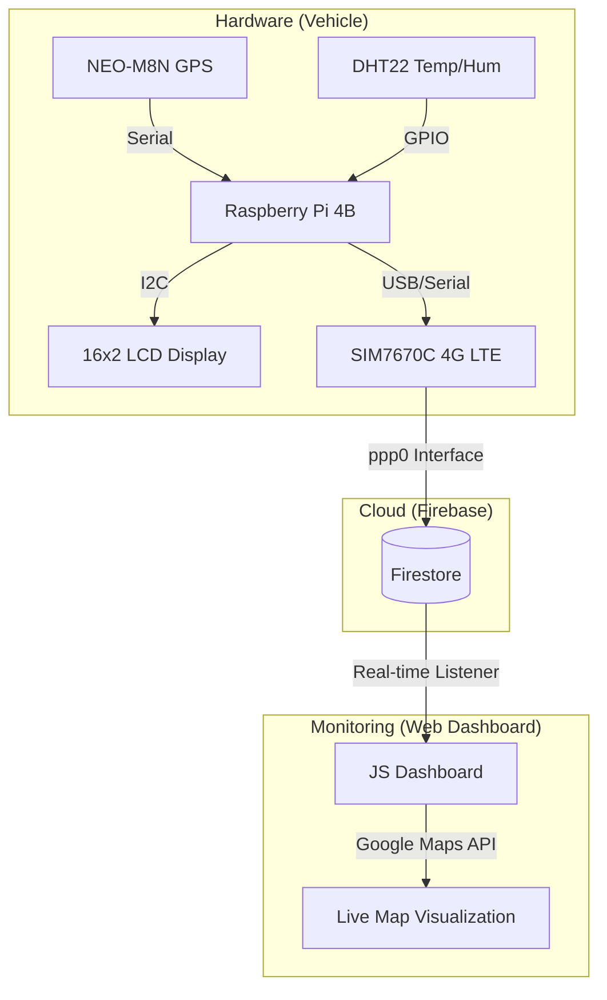
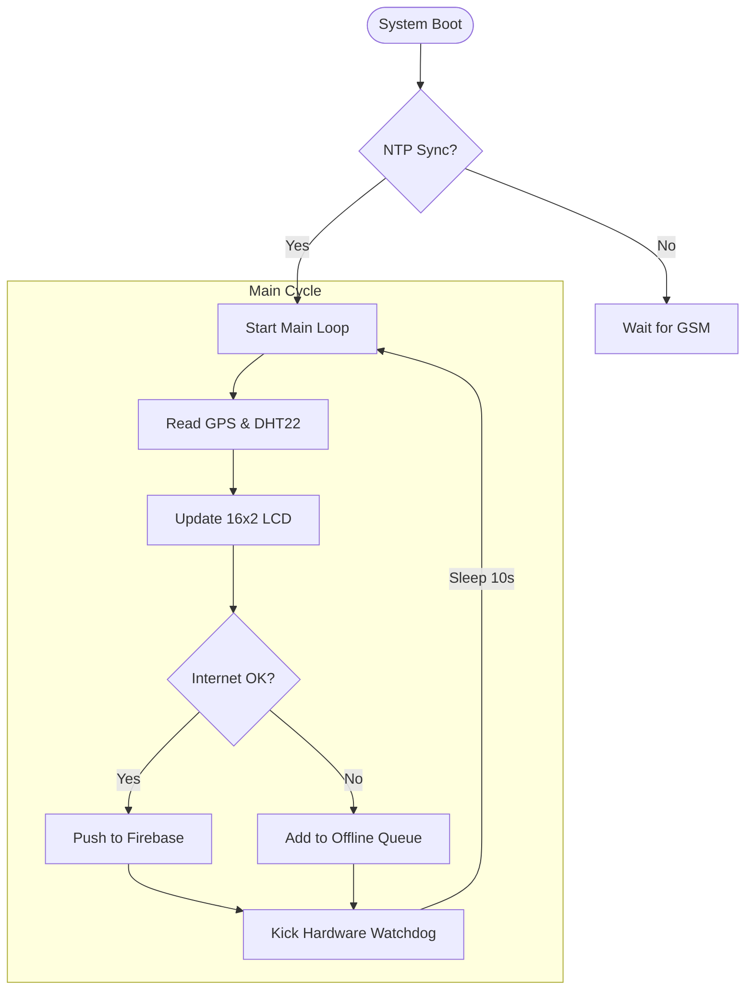

# 📡 IoT Live Vehicle Tracker (Bulletproof Edition)


-00e5ff?style=for-the-badge)

A mission-critical, real-time IoT tracking system built for maximum uptime and environmental resilience. This "Bulletproof Edition" features hardware-level watchdogs, strict network isolation, and self-healing connectivity.

---

## 🏗️ System Architecture



---

## ⚡ Bulletproof Features

- **🔒 Strict Network Isolation**: Outbound traffic is locked to the `ppp0` interface via `iptables`. Prevents data leakage via WiFi/Ethernet.
- **🛡️ Self-Healing Logic**:
  - **Hardware Watchdog**: Kernel-level `/dev/watchdog` support. If the script freezes, the Pi reboots automatically.
  - **GSM Watchdog**: A background thread monitors `ppp0`. If the connection drops, it automatically restarts the `gprs.service`.
  - **Auto NTP Sync**: Synchronizes the system clock on startup to ensure accurate Firestore timestamps.
- **📦 Offline Persistence**: Failed uploads are queued in a local buffer (up to 100 records) and retried once connectivity is restored.
- **📟 Diagnostic Display**: 4-page flipping LCD interface showing live Coordinates, Network Status, Sensors, and System Health.

---

## 🔄 Logic Flow



---

## 🛠️ Hardware Requirements

| Component | Description |
| :--- | :--- |
| **Microcontroller** | Raspberry Pi 4B (Recommended) |
| **GPS Module** | NEO-M8N (via `/dev/serial0`) |
| **Sensors** | DHT22 (Temperature & Humidity) |
| **Display** | 16x2 I2C LCD (PCF8574 at 0x3F) |
| **Modem** | SIM7670C 4G LTE (ppp0 connection) |

---

## 🚀 Deployment

### 1. Hardware Setup
- Connect GPS to UART pins.
- Connect DHT22 to GPIO.
- Connect LCD to I2C pins.
- Ensure the SIM7670C is configured as a `ppp0` interface using `wvdial` or `nmcli`.

### 2. Software Installation
```bash
# Clone the repository
git clone https://github.com/RatishPatil37/IOT_TRACKER.git

# Install dependencies
pip install firebase-admin adafruit-circuitpython-dht RPLCD pynmea2
```

### 3. Execution
Run the "Bulletproof" script:
```bash
python3 "Final_code (1).py"
```

---

## 📜 Credits
Developed by **Ratish Patil** for advanced IoT vehicle monitoring and logistics.
